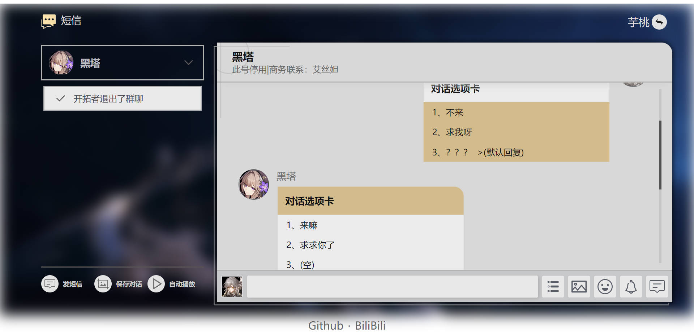
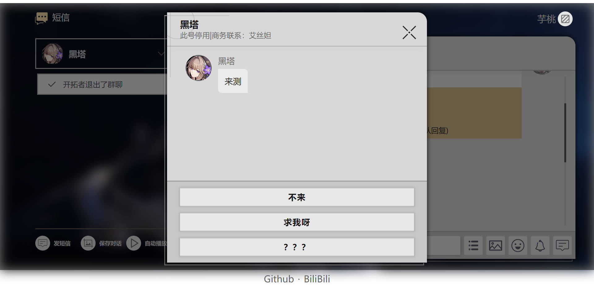

# 星穹铁道短信生成器

> 原项目： [https://github.com/blacktunes/sr-message-maker](https://github.com/blacktunes/sr-message-maker)
> 
> 在线体验： [https://sr.shenmedouyou.top/](https://sr.shenmedouyou.top/)
> 
> 演示视频： [怎么才能让星穹铁道的角色给你发短信？当然是自己动手啦！崩铁短信生成器已上线](https://www.bilibili.com/video/BV1114y1m7WR)

B站：[https://space.bilibili.com/511657380](https://space.bilibili.com/511657380)

<br/>

**[https://sr.yutaoy.top](https://sr.yutaoy.top)**

***

**PS.*(我遇到的问题)***

```
npm install
```

如失败或就试下面这行

```
npm install --legacy-peer-deps
```

完成后重启编辑器

***

## 预览图





## 项目详情

- **新增** 模拟对话选项
- **新增** 更多BUG
- **新增** 一些小细节
- **优化** 许多记不清了的（可能是负优化）
- **修复** 一些BUG（全部是不可能的）
